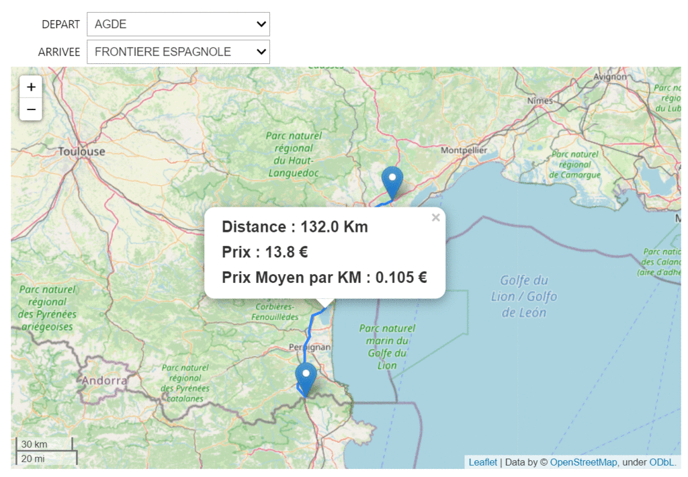
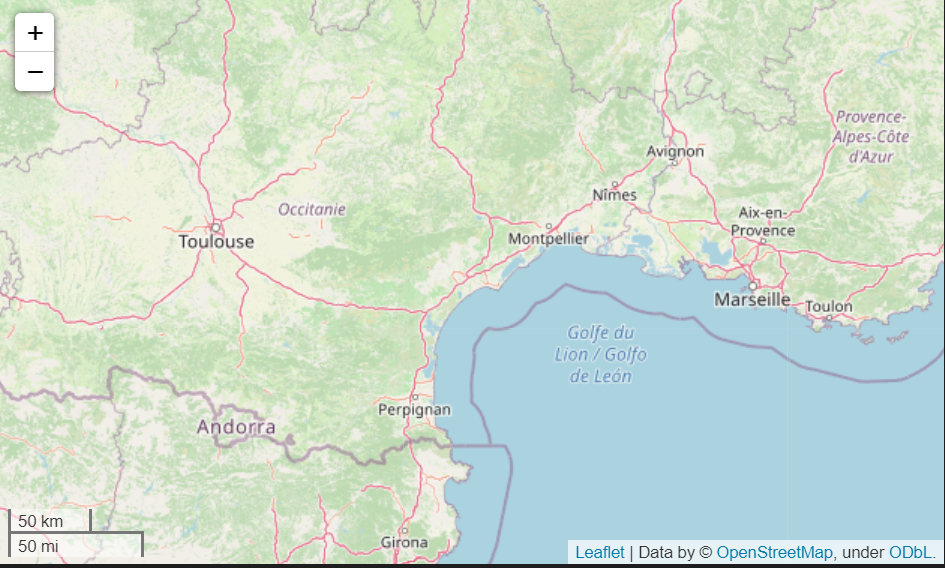
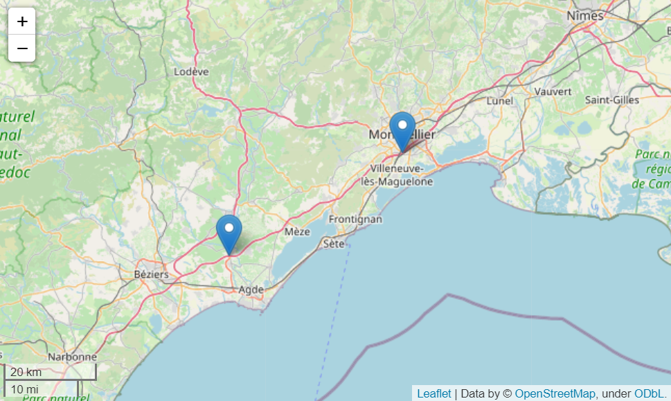
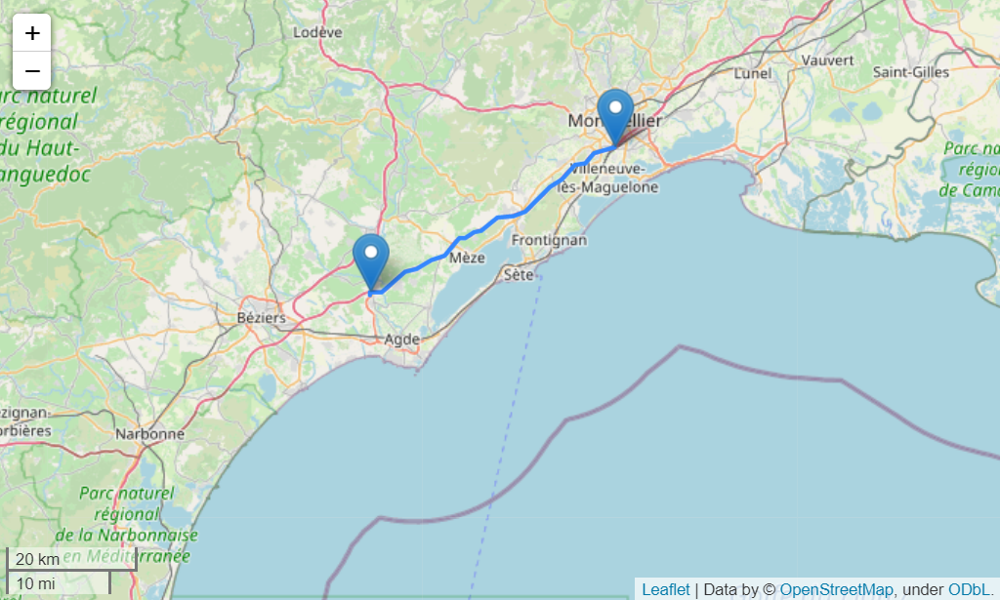
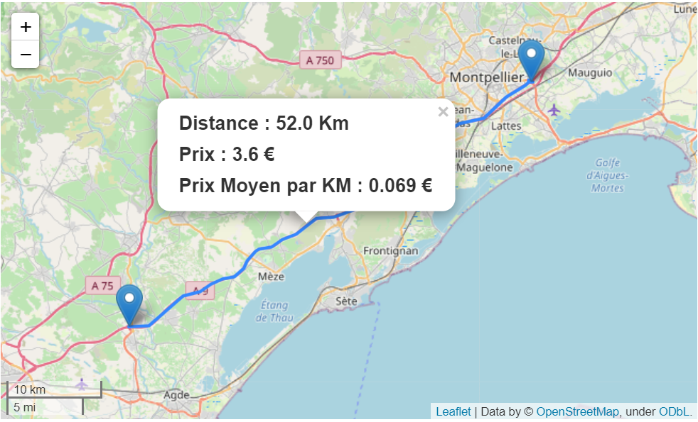

objectif
=========

L'objectif principal de cette partie est de créer une carte interactive avec le package ``folium`` afin
d'afficher l'itinéraire, la distance, le prix ainsi que le prix par kilomètre entre deux gares données par l'utilisateur.

Importer les bibliothèques requises
===================================

Comme nous continuons avec le langage Python, nous pouvons simplement exécuter

.. code-block:: python
  :linenos:
  
  from download import download
  import pandas as pd
  import folium
  from openrouteservice import convert
  import openrouteservice
  import json
  from ipywidgets import interact 

Lecture des bases de données 
============================
.. warning::
 * L'importation de la base de données "Base.csv" qui contient les noms des gares ainsi que leurs coordonnées GPS.

.. code-block:: python
  :linenos:
  
  url = 'https://raw.githubusercontent.com/SENEAssane/ProjectGroup7/main/Package/Data/Base.csv'
  path = os.path.join(os.getcwd(),'Base.csv')
  download(url, path, replace=True)
  geo = pd.read_csv('./Base.csv')
  geo = geo.rename(columns={' NOMGARE ':'NOM GARE'})

.. warning::
 * L’importation de la base de données « dataprixnettoye.csv » qui contient les prix d’autoroutes entre toutes les gares de notre carte après le nettoyage.
.. code-block:: python
  :linenos:
  
  ur1 = 'https://raw.githubusercontent.com/SENEAssane/ProjectGroup7/main/Package/Data/dataprixnettoye.csv'
  path = os.path.join(os.getcwd(),'dataprixnettoye.csv')
  download(ur1, path, replace=True)
  prix = pd.read_csv('./dataprixnettoye.csv')

.. warning::
 * L’importation de la base de données « Datadistance.csv » qui contient les distances d’autoroutes entre toutes les gares de notre carte.

.. code-block:: python
  :linenos:
  
  ur1 = 'https://raw.githubusercontent.com/SENEAssane/ProjectGroup7/main/Package/Data/Datadistance.csv'
  path = os.path.join(os.getcwd(),'Datadistance.csv')
  download(ur1, path, replace=True)
  Dist = pd.read_csv('./Datadistance.csv')

Etape requises
==============
.. warning::
 * Cette fonction permet de calculer la distance entre deux gares données, à partir de la base de données « Datadistance.csv ».

.. code-block:: python
  
    def Distab(a,b):
    return (Dist.iloc[a][b+1])

.. rst-class:: sphx-glr-script-out

  .. list-table::  Exemple 
   :widths: 25 
   :header-rows: 1

   * - input : Les indices des deux gares (4,25)
   * - output : La distance entre les deux gares 242.0 km
   
   
 .. code-block:: python

       >> Distab(4,25)
       >> 242.0

.. warning::
 * Cette fonction permet de calculer le prix entre deux gares données, à partir de la base de donnée « dataprixnettoye.csv ».

.. code-block:: python
 
   def prixab(a,b):
   return (prix.iloc[a][b+1])

.. rst-class:: sphx-glr-script-out

  .. list-table::  Exemple 
   :widths: 25 
   :header-rows: 1

   * - input : Les indices des deux gares (4,25)
   * - output : Le prix entre les deux gares 23.7 € 
   
 
 .. code-block:: python

       >> prixab(4,25)
       >> 23.7

.. warning::
 * création d'une liste qui contient les noms de toutes les gares de notre carte.

.. code-block:: python

   villes = sorted(geo.NOMGARE.unique())

.. warning::
 * Ce code nous permettant de passer du nom du gare (par exemple "MONTPELLIER EST") à son index dans la base de données geo.

.. code-block:: python

   i = geo.loc[geo['NOMGARE'] == "MONTPELLIER EST"].index[0]

Tracer des itinéraires
=======================

* Pour afficher la carte interactive du Sud-Ouest de la France nous avons utiliser le code suivant.

.. code-block:: python

  client = openrouteservice.Client(key='........')
  m = folium.Map(location=[43.654448,3.992643],zoom_start=10, control_scale=True)
  m

Vous pouvez changer le paramètre ``location`` par les coordonner GPS de votre propre carte, et pour configurer le client openrouteservice avec 
la clé api (``key``) , vous pouvez vous inscrire sur https://openrouteservice.org si vous n'avez pas de clé API. C'est totalement gratuit

* Pour afficher deux points sur la carte on utiliser le code suivant, par exemple les points de coordonner : (3.415880824819294, 43.37686025015687) et (3.875141, 43.573942)

.. code-block:: python

      coords = ((3.415880824819294, 43.37686025015687),(3.875141, 43.573942))
      folium.Marker(
             location=list(coords[0][::-1]),).add_to(m)
      folium.Marker(
               location=list(coords[1][::-1])).add_to(m)

* Comme notre objectif est de tracer la route entre des points donnés, nous pourrions utiliser l'attribut de géométrie des routes.
 
.. code-block:: python
    
        geometry = client.directions(coords)['routes'][0]['geometry']
        decoded = convert.decode_polyline(geometry)
        folium.GeoJson(decoded).add_child(folium.Popup(max_width=300)).add_to(m)

* Pour ajouter le texte de la fenêtre contextuelle lorsque nous cliquons sur l'itinéraire.

.. code-block:: python
    
        distance_txt = "<h4> <b>Distance :&nbsp" + "<strong>"+str(round(res['routes'][0]['summary']['distance']/1000,1))+" Km </strong>" +"</h4></b>"
        prix_txt = "<h4> <b>Prix :&nbsp" + "<strong>"+str(pr)+" € </strong>" +"</h4></b>"
        prix_moy_txt = "<h4> <b>Prix Moyen par KM :&nbsp" + "<strong>"+str(round(moy,3))+" € </strong>" +"</h4></b>"
        folium.GeoJson(decoded).add_child(folium.Popup(distance_txt+prix_txt+prix_moy_txt,max_width = 300)).add_to(m)

Widgets
========
.. warning::
 Pour la création de Widgets nous avons utiliser la fonction ``interact`` du package ``ipywidgets``. 

.. code-block:: python

       # Affichage de la carte avec la fonction interact
       interact(itineraire, DEPART = villes, ARRIVEE = villes)
      
..  hint ::
 La fonction itineraire est une fonction qui prend comme input les noms de deux gares et 
 elle revoit la carte maps qui contient l'itineraire ainsi que la distance, le prix et le prix 
 moyen par kilomètre entre les deux gares.

Si vous voulez le code complet, vous pouvez consulter le lien suivant : 
https://github.com/SENEAssane/ProjectGroup7/blob/main/Package/Script/Carte_interactif.py

