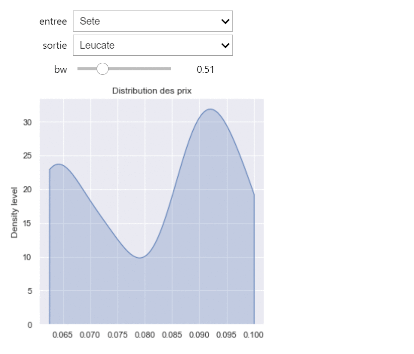

Kernel Density Estimation (KDE)
===============================

Dans cette partie, nous allons essayer de donner un KDE (distribution, estimation, tracer de courbe, ...) des prix par km entre une entrée et une sortie choisies, à l'aide de fonction interact contenue dans le module ipywidgets.

Packages necessaires pour le travail
=====================================

.. code-block:: python
  :linenos:
  
  from download import download
  import pandas as pd
  import matplotlib.pyplot as plt
  import seaborn as sns; sns.set()
  import numpy as np
  import os
  from scipy.stats.kde import gaussian_kde
  from ipywidgets import widgets, interact, interactive, fixed, interact_manual
  from Opti_traj import *
  from IPython import get_ipython
  import requests
  import json

KDE des prix par kilomètre
===========================================
.. warning::
 * importer la base de données Datadistance.csv 

.. code-block:: python
  :linenos:

  ur1 = 'https://raw.githubusercontent.com/SENEAssane/ProjectGroup7/main/Package/Data/Datadistance.csv'
  path = os.path.join(os.getcwd(),'Datadistance.csv')
  download(ur1, path, replace = True)
  Dist = pd.read_csv('./Datadistance.csv')

.. warning::
 * importer la base de données dataprixnettoye.csv

.. code-block:: python
  :linenos:

  ur1 = 'https://raw.githubusercontent.com/SENEAssane/ProjectGroup7/main/Package/Data/dataprixnettoye.csv'
  path = os.path.join(os.getcwd(),'dataprixnettoye.csv')
  download(ur1, path, replace = True)
  prix = pd.read_csv('./dataprixnettoye.csv')

.. warning::
 * Cette fonction calcule le prix entre toutes les sorties successives parmi toutes les sorties qui se trouvent entre i et j. 

.. code-block:: python
  
    def Distribution_Prix(i,j):
        V = nbSorties(i,j)
        Pr = []
        for i in range(len(V)-1):
         Pr.append(prixab(V[i],V[i+1]))
        return Pr

.. rst-class:: sphx-glr-script-out

  .. list-table::  Exemple 
   :widths: 25 
   :header-rows: 1

   * - input : Les indices des deux gares (5,22)
   * - output : le prix entre toutes les sorties successives

.. code-block:: python

       >> Distribution_Prix(5,22)
       >> [1.9, 1.0, 0.7, 2.0, 0.4, 1.8, 2.4, 0.7, 1.7, 1.3, 2.0]

   
.. warning::
 * Cette fonction calcule la distance entre toutes les sorties successives parmi toutes les sorties qui se trouvent entre i et j. 

.. code-block:: python
    
    def Distribution_dist(i,j):
        V = nbSorties(i,j)
        Ds = []
        for i in range(len(V)-1):
          Ds.append(Distab(V[i],V[i+1]))
        return Ds   

.. rst-class:: sphx-glr-script-out

  .. list-table::  Exemple 
   :widths: 25 
   :header-rows: 1

   * - input : Les indices des deux gares (2,8)
   * - output : la distance entre toutes les sorties successives
   
   
 .. code-block:: python

       >> Distribution_dist(2,8)
       >> [4.0, 5.0, 19.0, 26.0, 16.0, 8.0]   

.. warning::
 * Cette fonction permet de calculer le prix par km entre toutes les sorties successives parmi toutes les sorties qui se trouvent entre i et j.

.. code-block:: python

    def moyDist(i,j):
        X = Distribution_Prix(i,j)
        Y = Distribution_dist(i,j)
        V = []
        for i in range(len(X)):
          V.append(float(X[i]/Y[i]))
        return V 

.. rst-class:: sphx-glr-script-out

  .. list-table::  Exemple 
   :widths: 25 
   :header-rows: 1

   * - input : Les indices des deux gares (0,6)
   * - output : le prix par km entre toutes les sorties successives
   
   
 .. code-block:: python

       >> moyDist(0,6)
       >> [0.0, 0.0, 0.0, 0.0, 0.08421052631578947, 0.07307692307692307]  

.. warning::
 *  création d'une liste qui contient les noms de toutes les gares de notre carte.    

.. code-block:: python
  :linenos:

  villes = [] 
  for i in range (len(S)):
    villes.append(prix.columns[S[i]+1])

.. warning::
 * Kernel Density Estimation (KDE)
 * affiche la distribution (estimation de la densité) des prix par km entre deux sorties choisies.   

.. code-block:: python
  :linenos:

  def kde_explore(entre = villes, sortie = villes,  bw = 0.3):
      i = transformN(entre)
      j = transformN(sortie)
      V = moyDist(i,j)
      fig, ax = plt.subplots(1, 1, figsize = (5, 5))
      sns.kdeplot(np.asarray(V) , bw_adjust = bw, shade = True, cut = 0, ax = ax)
      plt.ylabel("Density level")
      plt.title("Distribution des prix")
      plt.tight_layout()
      plt.show()

  interact(kde_explore, entre = villes, sortie = villes, bw = (0.001, 2, 0.01))

